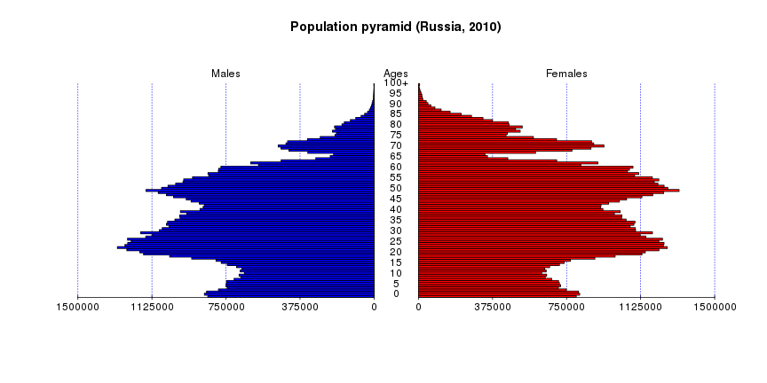

## Russian Censuses App  
The Russian Censuses shiny application is a course project for Coursera and "Developing Data Products".    
The application shows the distribution of the age groups in the population of Russia across the census data since 1897  untill 2010.  

Data for application is a dataset combining the male and female cohort population:  

```r
mainData <- read.csv(file = "data/ruscensus.csv", header = TRUE, sep = ";")
print(mainData[1:4, 1:8])
```

```
##     m1897   f1897   m1926   f1926   m1939   f1939   m1959   f1959
## 1 1236066 1235000 1553272 1512110 1904698 1851813 1362410 1311282
## 2  973400  988112 1277896 1262002 1568194 1538801 1352420 1298272
## 3  942004  956838 1222107 1218125 1303287 1286625 1333686 1284417
## 4  929882  955203 1248013 1244541 1166121 1154801 1363860 1312176
```

---

## Application interface  
Shiny apps interface allows to select the desired census year:  

  

and specify a cohorts (age groups) size  

  

According to these options the application draws the population diagram.  

---

## Population pyramid  
To plot the diagrams the app uses a laconic [pyramyd library](http://minato.sip21c.org/swtips/R.html#PYRAMID) by Minato Nakazawa. The library is also available in the CRAN repository (in english fortunately). It provides us quite handy population pyramids:


```r
  pyramidm(mainData[,17:18], "2010", 1)
```



--- .class #5 

## The End (by James Douglas Morrison)
As a result we have got an application like this one:  

  
