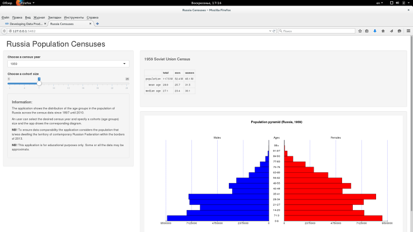

## Russian Censuses App  
The Russian Censuses shiny application is a course project for Coursera and "Developing Data Products".    
The application shows the distribution of the age groups in the population of Russia across the census data since 1897  untill 2010.  

Data for application is a dataset combining the male and female cohort population:  

```r
mainData <- read.csv(file = "data/ruscensus.csv", header = TRUE, sep = ";")
```

```
## Warning in file(file, "rt"): не могу открыть файл 'data/ruscensus.csv':
## Нет такого файла или каталога
```

```
## Error in file(file, "rt"): не могу открыть соединение
```

```r
print(mainData[1:4, 1:8])
```

```
## Error in print(mainData[1:4, 1:8]): объект 'mainData' не найден
```

---

## Application interface  
Shiny apps interface allows to select the desired census year:  

  

and specify a cohorts (age groups) size  

  

According to these options the application draws the population diagram.  

---

## Population pyramid  
To plot the diagrams the app uses a laconic [pyramyd library](http://minato.sip21c.org/swtips/R.html#PYRAMID) by Minato Nakazawa. The library is also available in the CRAN repository (in english fortunately). It provides us quite handy population pyramids:

```
## Loading required package: pyramid
```

```r
  pyramidm(mainData[,17:18], "2010", 1)
```

```
## Error in nrow(data): объект 'mainData' не найден
```

--- .class #5 

## The End (by James Douglas Morrison)
As a result we have got an application like this one:  

  
